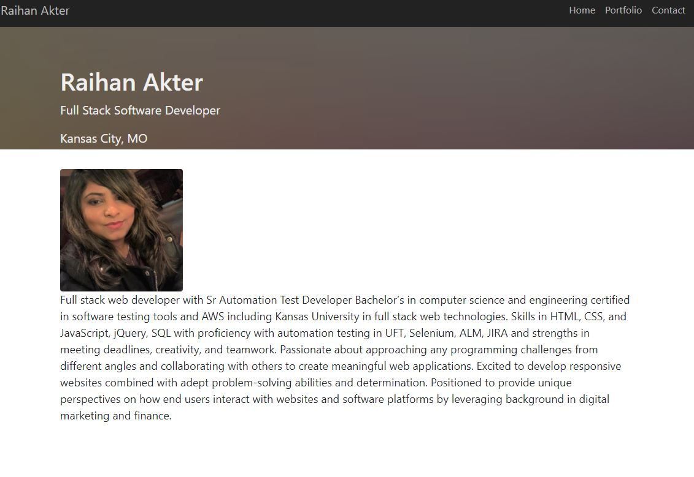
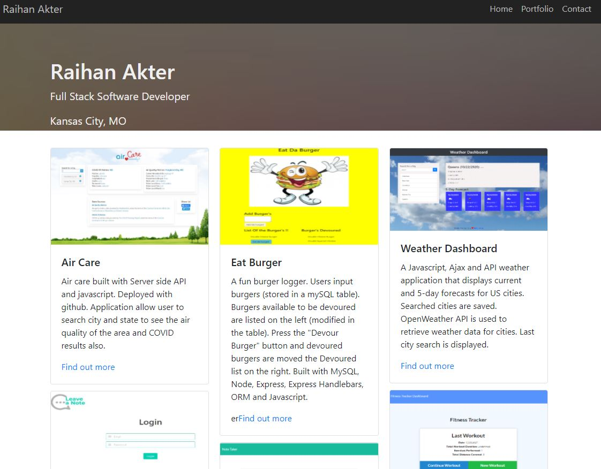
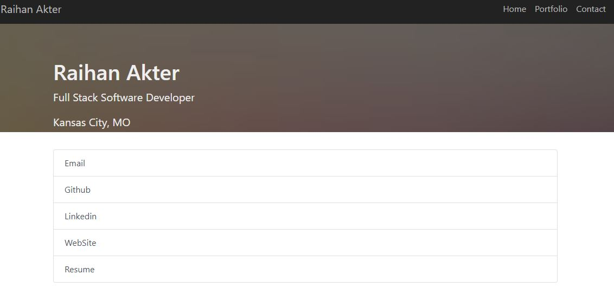

## React Portfolio

* GitHub Repo: https://github.com/RaihanAkter03/React_Portfolio
* Heroku URL : https://stormy-ocean-81333.herokuapp.com/

## Built With
* React.js
* HTML
* CSS
* React
* React-Bootstrap
* Styled-Components

 
## Special Features
- Home Page
- Portfolio Page
- Contact  Page

Deployed on Heroku: <a href="https://stormy-ocean-81333.herokuapp.com/" target="blank">React Portfilio</a>

## Technical Discription :

* Download or clone the repository. Install npm . Then npm start. application will be running on localhost://3000.

* deplyed application 

